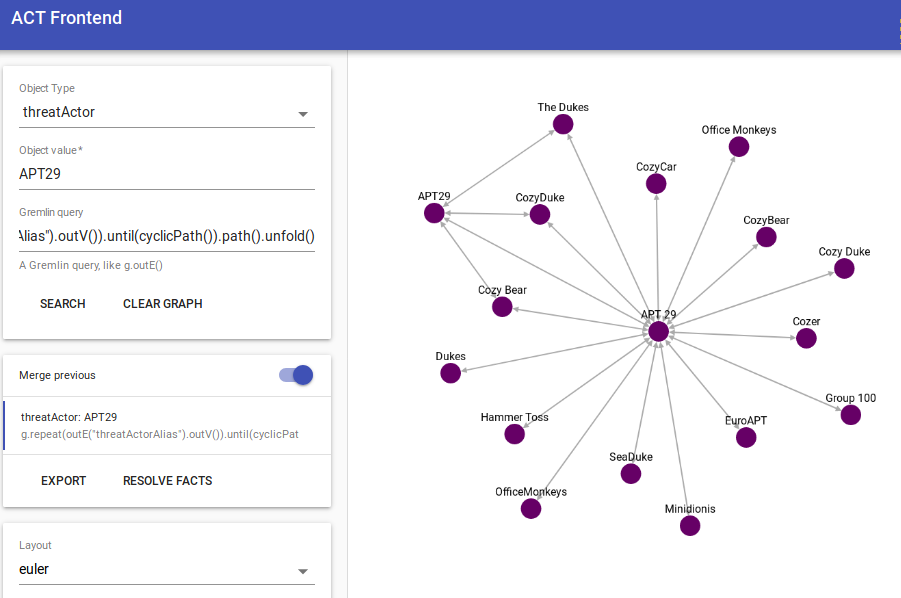

# python-act

python-act is a library used to connect to the [ACT platform](https://github.com/mnemonic-no/act-platform).

The source code for this API is availble on [github](https://github.com/mnemonic-no/act-api-python) and on
[PyPi](https://pypi.org/project/act-api).

# Changelog

## 1.0.27

* facts created with act.api.Act.fact() will now have "RoleBased" as default access_mode.
  You can initialize with act.api.Act(access_mode="Public") to get the old defaults.
* facts created with act.api.fact.Fact() now requires the user to specify access_mode


# Setup

Install from PyPi:

```
$ pip3 install act-api
```

The platform has a REST api, and the goal of this library is to expose all functionality in the API.

# Objects and Facts

The act platform is built on two basic types, the object and fact.

Objects are universal elements that can be referenced uniquely by its value. An example of an object can be an IP address.

Facts are assertions or obsersvations that ties objects together. A fact may or may not have a value desribing further the fact.


Facts can be linked on or more objects. Below, the mentions fact is linked to both an ipv4 object and report object, but the hasTitle fact is only linked to a report.

|Object type|Object value|Fact type|Fact value|Object type|Object value|
| ----------|------------|---------|----------|-----------|------------|
|report     |cbc80bb(...)|mentions |*n/a*          |ipv4       |127.0.0.1   |
|report     |cbc80bb(...)|name     |Threat Intel Summary|*n/a*|*n/a*|

# Design principles of the Python API.

* Most functions returns an object that can be chained
* Attributes can be accessed using dot notation (e.g fact.name and fact.type.name)

# Example usage

## Connect to the API

Connct to the API using an URL where the API is exposed and a user ID:

```
>>> import act.api
>>> c = act.api.Act("https://act-eu1.mnemonic.no", user_id = 1, log_level = "warning")
```

The returned object exposes most of the API in the ACT platform:

* fact - Manage facts
* fact_search - Search facts
* fact_type - Instantiate a fact type
* get_fact_types - Get fact types
* object - Manage objects
* object_search - Searh objects
* origin - Manage origins
* get_object_types - Get object types

Additional arguments to act.api.Act can be passed on to [requests](http://docs.python-requests.org) using the requests_common_kwargs, which mans you can add for instance `auth` if the instance is behind a reverse proxy with HTTP authentication:

```
>>> c = act.api.Act("https://act-eu1.mnemonic.no", user_id = 1, log_level = "warning", requests_common_kwargs = {"auth": ("act", "<PASSWORD>")})
```

## Create fact

Create a fact by calling `fact()`. The result can be chained using one or more `source()`, `destination()` or `bidirectionial()` to add linked objects.

```
>>> f = c.fact("mentions").source("report", "87428fc522803d31065e7bce3cf03fe475096631e5e07bbd7a0fde60c4cf25c7").destination("ipv4", "127.0.0.1")
>>> f
Fact(type='mentions', access_mode='RoleBased', source_object=Object(type='report', value='87428fc522803d31065e7bce3cf03fe475096631e5e07bbd7a0fde60c4cf25c7'), destination_object=Object(type='ipv4', value='127.0.0.1'))
```

The fact is not yet added to the platform. User `serialize()` or `json()` to see the parameters that will be sent to the platform when the fact is added.

```
>>> f.serialize()
{'type': 'mentions', 'value': '', 'accessMode': 'RoleBased', 'sourceObject': {'type': 'report', 'value': '87428fc522803d31065e7bce3cf03fe475096631e5e07bbd7a0fde60c4cf25c7'}, 'destinationObject': {'type': 'ipv4', 'value': '127.0.0.1'}, 'bidirectionalBinding': False}
>>> f.json()
'{"type": "mentions", "value": "", "accessMode": "RoleBased", "sourceObject": {"type": "report", "value": "87428fc522803d31065e7bce3cf03fe475096631e5e07bbd7a0fde60c4cf25c7"}, "destinationObject": {"type": "ipv4", "value": "127.0.0.1"}, "bidirectionalBinding": false}'
```

Since the fact is not yet added it does not have an id.

```
>>> print(f.id)
None
```

Use `add()` to add the fact to the platform.
```
>>> f.add()
Fact(type='mentions', origin=Origin(name='John Doe', id='00000000-0000-0000-0000-000000000001'), confidence=1.0, organization=Organization(name='Test Organization 1', id='00000000-0000-0000-0000-000000000001'), access_mode='RoleBased', source_object=Object(type='report', value='87428fc522803d31065e7bce3cf03fe475096631e5e07bbd7a0fde60c4cf25c7', id='3eb92445-c88f-4128-8bd1-1cd27a95a088'), destination_object=Object(type='ipv4', value='127.0.0.1', id='95d200cf-89e9-4e6f-9e4f-973f2f88dd11'))
```

The fact will be replaced with the fact added to the platform and it will now have an id.
```
>>> print(f.id)
'5e533787-e71d-4ba4-9208-531f9baf8437'
```

A string representation of the fact will show a human readable version of the fact.
```
>>> str(f)
'(report/87428fc522803d31065e7bce3cf03fe475096631e5e07bbd7a0fde60c4cf25c7) -[mentions/ipv4]-> (ipv4/127.0.0.1)'
```

### Specifying origins when creating facts

You can specify origins, when creating facts:

```
>>> act.api.base.origin_map(c.config)
{'John Doe': '00000000-0000-0000-0000-000000000001', 'Test origin': '5da8b157-5129-4f2f-9b90-6d624d62eebe'}
>>> f = c.fact("mentions", origin=c.origin(name="Test origin")).source("report", "87428fc522803d31065e7bce3cf03fe475096631e5e07bbd7a0fde60c4cf25c7").destination("ipv4", "127.0.0.1")
>>> f.serialize()
{'type': 'mentions', 'value': '', 'origin': '5da8b157-5129-4f2f-9b90-6d624d62eebe', 'accessMode': 'RoleBased', 'sourceObject': {'type': 'report', 'value': '87428fc522803d31065e7bce3cf03fe475096631e5e07bbd7a0fde60c4cf25c7'}, 'destinationObject': {'type': 'ipv4', 'value': '127.0.0.1'}, 'bidirectionalBinding': False}
```

You can use `origin_name` or `origin_id` when connecting to the API to apply an origin to all facts:
```
>>> c = act.api.Act("", user_id = 1, log_level="warn", origin_name="Test-origin")
>>> f = c.fact("mentions").source("report", "87428fc522803d31065e7bce3cf03fe475096631e5e07bbd7a0fde60c4cf25c7").destination("ipv4", "127.0.0.1")
>>> f.origin
Origin(name='Test-origin')
```

### Specifying access_mode when crating facts

Default access mode when creating facts are "RoleBased". This means that facts belong to an organization
and only users with access to that organization have access to the fact.

To create Public facts, available to everyone you can use `access_mode = "Public"`:

```
>>> f = c.fact("mentions", access_mode="Public").source("report", "87428fc522803d31065e7bce3cf03fe475096631e5e07bbd7a0fde60c4cf25c7").destination("ipv4", "127.0.0.1")
>>> f
Fact(type='mentions', access_mode='Public', source_object=Object(type='report', value='87428fc522803d31065e7bce3cf03fe475096631e5e07bbd7a0fde60c4cf25c7'), destination_object=Object(type='ipv4', value='127.0.0.1'))
```

## Get fact
Use `get()` to get a fact by it's id.
```
>>> f = c.fact(id='4dc14f42-f175-4695-8ddb-d372b3138ec8').get()
```

Properties on objects can be retrieved by dot notation.
```
>>> f.type.name
'name'
>>> f.value
'Threat Intel Summary'
''
```

## Add Meta facts
Use `meta()` to create meta facts (facts about facts).

```
>>> f = c.fact(id='f994810d-3e4e-4f08-b1c4-a0b67cd1b8fc').get()
>>> import time
>>> meta = f.meta("observationTime", int(time.time()))
>>> meta
Fact(type='observationTime', value=1605100652, in_reference_to=Fact(type='mentions', id='f994810d-3e4e-4f08-b1c4-a0b67cd1b8fc'), access_mode='RoleBased')
```
As with facts, the meta fact is not sent to the backend, and you must use `add()` to submit it to the platform.

```
>>> meta.add()
MetaFact(type='observationTime', value='1605100652', origin=Origin(name='John Doe', id='00000000-0000-0000-0000-000000000001'), confidence=1.0, in_reference_to=Fact(type='mentions', id='f994810d-3e4e-4f08-b1c4-a0b67cd1b8fc'), organization=Organization(name='Test Organization 1', id='00000000-0000-0000-0000-000000000001'), access_mode='RoleBased')
```

## Get Meta facts
Use `get_meta()` to get meta facts (facts about facts).

```
>>> f = c.fact(id='6d80469f-bc73-4520-a82a-7667a6526362').get()
>>> meta = f.get_meta()
>>> print(meta[0])
[observationTime/2018-12-12T13:42:17.526912]
```


## Retract fact
Use `retract()` to retract a fact.. The fact *must* have an id, either by specyfing it directly, or retriving the fact from a search.

```
>>> f = c.fact(id='1ba6c36a-8300-4ea1-aded-03ee80083dff')
>>> f.retract()
```

## Search Objects

```
>>> objects = c.object_search(object_value="127.0.0.1", after="2016-09-28T21:26:22Z")
>>> len(objects)
1
>>> objects[0].type.name
'ipv4'
>>> objects[0].value
'127.0.0.1'
>>> objects[0].statistics[0].type.name
'DNSRecord'
>>> objects[0].statistics[0].count
131
>>> objects[0].statistics[1].type.name
'mentions'
>>> objects[0].statistics[1].count
114
```

## Create object type

```
>>> object_type = c.object_type("fqdn").add()
```


## Search facts
Search fact and limit search by using the parameters.
```
>>> help(c.fact_search)
Help on method fact_search in module act.helpers:

fact_search(keywords='', object_type=[], fact_type=[], object_value=[], fact_value=[], organization=[], source=[], include_retracted=None, before=None, after=None, limit=None) method of act.helpers.Act instance
    Search objects
    Args:
        keywords (str):               Only return Facts matching a keyword query
        object_type (str[] | str):    Only return Facts with objects having a specific
                                      ObjectType
        fact_type (str[] | str):      Only return Facts having a specific FactType
        object_value (str[] | str):   Only return Facts with objects matching a specific
                                      value
        fact_value (str[] | str):     Only return Facts matching a specific value
        organization (str[] | str):   Only return Facts belonging to
                                      a specific Organization
        origin (str[] | str):         Only return Facts coming from a specific Origin
        include_retracted (bool):     Include retracted Facts (default=False)
        before (timestamp):           Only return Facts added before a specific
                                      timestamp. Timestamp is on this format:
                                      2016-09-28T21:26:22Z
        after (timestamp):            Only return Facts added after a specific
                                      timestamp. Timestamp is on this format:
                                      2016-09-28T21:26:22Z
        limit (integer):              Limit the number of returned Objects
                                      (default 25). Limit must be <= 10000.

    All arguments are optional.

    Returns ActResultSet of Facts.
```

By default the search will return and ActResultSet with 25 itmes.
```
>>> facts = c.fact_search(fact_type="mentions", fact_value="ipv4")
>>> len(facts)
25
>>> facts.size
25
>>> facts.count
820304
```
The `complete` property can be used to to check whether the result returned all available items.

```
>>> facts.complete
False
```

Use the limit parameter to get more items.
```
>>> facts = c.fact_search(fact_type="mentions", object_value="127.0.0.1", limit=2000)
>>> facts.size
119
>>> facts.complete
True
```

## Get Object types
Get all object types.
```
>>> object_types = c.get_object_types()
>>> len(object_types)
46
>>> len(object_types)
46
>>> object_types[0].name
'technique'
>>> object_types[0].validator
'RegexValidator'
>>> object_types[0].validator_parameter
'(.|\\n)*'
```

## Graph queries
The act platform has support for graph queries using the Gremlin Query language.

Use the `traverse()` function from an object to perform a graph query.

```
>>> path = c.object("ipv4", "127.0.0.220").traverse('g.bothE("mentions").bothV().path().unfold()')
>>> type(path[0])
<class 'act.obj.Object'>
>>> type(path[1])
<class 'act.fact.Fact'>
```

You will normally want to use `unfold()` in the gremlin query to make sure you recive objects and facts.

Here is an example querying for threat actor aliases.

The graph of this will look like the screen shot below.



```
>>> aliases = c.object("threatActor", "APT 29").traverse('g.repeat(outE("threatActorAlias").outV()).until(cyclicPath()).path().unfold()')
>>> obj = [obj.value for obj in aliases if isinstance(obj, act.obj.Object)]
>>> obj
['APT 29', 'OfficeMonkeys', 'APT 29', 'APT 29', 'The Dukes', 'APT 29', 'APT 29', 'Hammer Toss', 'APT 29', 'APT 29', 'EuroAPT', 'APT 29', 'APT 29', 'CozyDuke', 'APT 29', 'APT 29', 'Office Monkeys', 'APT 29', 'APT 29', 'CozyCar', 'APT 29', 'APT 29', 'APT29', 'APT 29', 'APT 29', 'Dukes', 'APT 29', 'APT 29', 'Cozy Duke', 'APT 29', 'APT 29', 'Cozer', 'APT 29', 'APT 29', 'CozyBear', 'APT 29', 'APT 29', 'Cozy Bear', 'APT 29', 'APT 29', 'SeaDuke', 'APT 29', 'APT 29', 'Group 100', 'APT 29', 'APT 29', 'Minidionis', 'APT 29', 'APT 29', 'The Dukes', 'APT29', 'APT 29', 'APT 29', 'The Dukes', 'APT29', 'The Dukes', 'APT 29', 'CozyDuke', 'APT29', 'APT 29', 'APT 29', 'CozyDuke', 'APT29', 'CozyDuke', 'APT 29', 'APT29', 'The Dukes', 'APT29', 'APT 29', 'APT29', 'The Dukes', 'APT 29', 'APT 29', 'APT29', 'Cozy Bear', 'APT 29', 'APT 29', 'APT29', 'Cozy Bear', 'APT29', 'APT 29', 'APT29', 'CozyDuke', 'APT 29', 'APT 29', 'APT29', 'CozyDuke', 'APT29', 'APT 29', 'Cozy Bear', 'APT29', 'APT 29', 'APT 29', 'Cozy Bear', 'APT29', 'Cozy Bear', 'APT 29', 'The Dukes', 'APT29', 'Cozy Bear', 'APT 29', 'APT 29', 'The Dukes', 'APT29', 'Cozy Bear', 'APT29', 'APT 29', 'The Dukes', 'APT29', 'CozyDuke', 'APT 29', 'APT 29', 'The Dukes', 'APT29', 'CozyDuke', 'APT29', 'APT 29', 'CozyDuke', 'APT29', 'The Dukes', 'APT29', 'APT 29', 'CozyDuke', 'APT29', 'The Dukes', 'APT 29', 'APT 29', 'CozyDuke', 'APT29', 'Cozy Bear', 'APT 29', 'APT 29', 'CozyDuke', 'APT29', 'Cozy Bear', 'APT29', 'APT 29', 'Cozy Bear', 'APT29', 'The Dukes', 'APT29', 'APT 29', 'Cozy Bear', 'APT29', 'The Dukes', 'APT 29', 'APT 29', 'Cozy Bear', 'APT29', 'CozyDuke', 'APT 29', 'APT 29', 'Cozy Bear', 'APT29', 'CozyDuke', 'APT29']
>>> set(obj)
{'Office Monkeys', 'EuroAPT', 'Minidionis', 'APT29', 'OfficeMonkeys', 'Hammer Toss', 'CozyCar', 'The Dukes', 'Cozer', 'CozyBear', 'Cozy Bear', 'SeaDuke', 'Group 100', 'Dukes', 'CozyDuke', 'Cozy Duke', 'APT 29'}
```

# Type system

Most instances are bootstrapped with a type system that will cover most use cases. However, it is also possible to extend the system with additional objectTypes / factTypes.

## Add Object Types
You can add objects by creating ObjectType object and executing `add()`. There is also a shortcut available on the client (`object_type`) which can used like this:

```
>>> c.object_type(name="filename", validator_parameter='.+').add()
ObjectType(name='filename', id='432c6d8a-542c-4374-94d1-b14e95139877', validator_parameter='.+', namespace=NameSpace(name='Global', id='00000000-0000-0000-0000-000000000000'))
```

The validator_parameter specifies what values that are allowed on this object. In this example, any non-empty values are allowed.

## Add Fact Types

Facts specifies relation to one or two Objects and to add facts there must be FactTypes that specifies these bindings. There is a helper function that will create a Fact Type with bindings between all exisiting object types in the system:

```
>>>> c.create_fact_type_all_bindings("droppedBy", '.*')
(...)
```

However, on production systems it is advisable to only create bindings between objects that makes sense for the given Fact Type, like this:

```
>>> object_bindings = [{
    "destinationObjectType": "hash",
    "sourceObjectType": "filename"
}]

>>> c.create_fact_type("droppedBy", '.*', object_bindings = object_bindings)
FactType(name='droppedBy', id='cbc49137-3c52-4655-8b47-386d31de231a', validator_parameter='.*', relevant_object_bindings=[RelevantObjectBindings(source_object_type='432c6d8a-542c-4374-94d1-b14e95139877', destination_object_type='e4b673b6-7a59-4fca-b8eb-ff4489501cf5')], namespace=NameSpace(name='Global', id='00000000-0000-0000-0000-000000000000'))
```

The bindings will be created using a combination of all source/destination objects for each entry.

It is also possible to specify bidirectional bindings like this:

```
>>> object_bindings = [{
   "bidirectional": true,
   "destinationObjectType": "threatActor",
   "sourceObjectType": "threatActor"
}]
```

## Update Fact Types

Facts are immutable, so it is not possible to update the ObjectType and FactType validators, as this might lead to an incositence state. However, it is possible to add Object Bindings to existing facts. This function require the objets to be retrived first:

```
>>> dropped_by = [ft for ft in c.get_fact_types() if ft.name == "droppedBy"][0]
>>> hash = [ot for ot in c.get_object_types() if ot.name == "hash"][0]
>>> filename = [ot for ot in c.get_object_types() if ot.name == "filename"][0]
>>> dropped_by.id
'18b0f70e-82dc-4904-b745-d20b0ac54adf'
>>>> dropped_by.add_binding(source_object_type=filename, destination_object_type=hash)
```

## Origins

The platforms supports `origin` to support where the fact originates from. If now origin is given when creating a fact, the origin will be the user itself.

### List origin

You can list origins using `get_origins()`:

```
>>> c.get_origins()
[Origin(name='John Doe', id='00000000-0000-0000-0000-000000000001', namespace=NameSpace(name='Global', id='00000000-0000-0000-0000-000000000000'), organization=Organization(name='Test Organization 1', id='00000000-0000-0000-0000-000000000001'), trust=0.8)]
```

### Add origin

```
>>> o = c.origin("Test origin", trust=0.5, description="My test origin")
>>> o.add()
Origin(name='Test origin', id='5da8b157-5129-4f2f-9b90-6d624d62eebe', namespace=NameSpace(name='Global', id='00000000-0000-0000-0000-000000000000'), organization=Organization(), description='My test origin', trust=0.5)
```

### Get origin

```
>>> o = c.origin(id="5da8b157-5129-4f2f-9b90-6d624d62eebe")
>>> o.get()
Origin(name='Test origin', id='5da8b157-5129-4f2f-9b90-6d624d62eebe', namespace=NameSpace(name='Global', id='00000000-0000-0000-0000-000000000000'), organization=Organization(), description='My test origin', trust=0.5)
```

## Fact Chains

Fact chain is currently a experimental concept, that supports chains of fact, where some of the objects in the chain can unknowns / placeholders.

The unknowns are marked using value "*". And after the chain is created they will get a special value "[placeholder[<HASH>]]", where the HASH is caclulated based on the incoming/outgoing paths from the placeholder.

```
>>> facts = (
        c.fact("observedIn").source("uri", "http://uri.no").destination("incident", "*"),
        c.fact("targets").source("incident", "*").destination("organization", "*"),
        c.fact("memberOf").source("organization", "*").destination("sector", "energy"),
    )
>>> chain = act.api.fact.fact_chain(*facts)
>>> for fact in chain:
        fact.add()
```

This feature should be considered experimental and are subject to change. It is implemented client side and the backend does not have the notion of what a fact chain is at the moment, but the frontned will currently show the value in a more user friendly way.

Also note that adding facts in a chain as shown above is NOT atomic, and might lead to inconsistencies if some of the facts does not pass validation in the backend.

# Tests
Tests (written in pytest) are contained in the test/ folder. Mock objects are available for most API requests in the test/data/ folder.

This command will execute the tests using both python2 and python3 (requires pytest, python2 and python3).
```
test/run-tests.sh
```
